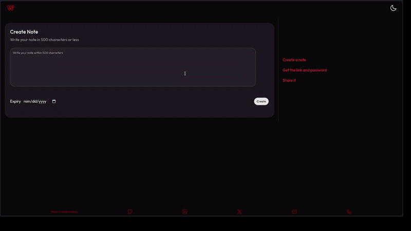

# Whisper

A secret note sharing app.



## Usage

- Create a note.
- Share the generated link and password to the recipient.
- They open the link.
- They enter the password to unlock the note.
- They read the note.
- They can summarize the note (Powered by AI).

## Architecture

Whisper is implemented as a small full-stack application with a clear separation between the frontend and backend services.

### Frontend

Deployed on **Vercel**

- **Next.js (App Router)** - Used along with modern **React** hooks like `useActionState`.
- **shadcn/ui**
- **Tailwind CSS**
- **Zod**

### Backend

Deployed on **Render**

- **Express.js with TypeScript**
- **Prisma ORM**
- **Zod**

### Database

Deployed on **Neon**

- **PostgreSQL** via **Prisma ORM**

### AI Integration

- **Google Gemini API**

### Background Jobs

A scheduled **Vercel** cron job hits an API endpoint and cleans up expired notes from the database periodically.

## API Overview

The API accepts and returns `json` where applicable.

### Create Note

**POST** `/notes`
Creates a new note.

> accepts `{note: string, expiry?: ISO format}`
>
> returns `{noteId: string, password: string}`

### Unlock Note

**POST** `/notes/:noteId`
Verifies password and returns the note content.

> accepts `{password: string}`
>
> returns `{note: string}`

### Generate Summary

**POST** `/notes/:noteId/summarize`
Generates an AI summary of the unlocked note using the Gemini API.

> accepts `{note: string}`
>
> return `{summary: string}`

## Repository structure

> ```
> /frontend -> Next.js Application
> /backend  -> Express API server
> /docs     -> Documentation assets
> ```

## Setup Instructions

1. Clone this [repository](https://github.com/ergomancer/whisper)
   `gh repo clone ergomancer/whisper`
   or
   `git clone https://github.com/ergomancer/whisper.git`
2. Navigate into the repository
   `cd whisper`
3. Install packages
   `npm install`
4. Create a database (referred to as `DB: whisper` in this document)
5. Add environment variables in `.env` files as follows
   1. in `/backend`
      1. `PORT` - port for the backend to listen to
      2. `APP_URL` - base URL for the frontend where this app is to be deployed (for local it will be `"http://localhost:3000"`)
      3. `DATABASE_URL` - url for `DB: whisper`
      4. `GEMINI_API_KEY` - your gemini api key
      5. `CRON_SECRET` - secret to authorize cron jobs - removal of expired entries
   2. in `/frontend`
      1. `BACKEND_URL` - url for the backend where this is deployed (for local it will be `"https://localhost:<PORT>"` : replace `<PORT>` with the value of the `PORT` in `.env` in `/backend`)
      2. `NEXT_PUBLIC_FRONTEND_URL` - url for the frontend. Same as `APP_URL` in `.env` in `/frontend`
      3. `CRON_SECRET` - secret to authorize cron jobs - removal of expired entries - same as `CRON_SECRET` in the `.env` in `/backtend`

6. Run prisma migrate and generate prisma client

   ```bash
   cd backend
   npx prisma migrate deploy
   npx prisma generate
   ```

7. Build backend and frontend

   ```bash
   # in /backend/
   npm run build # build backend
   npm run start # start backend server
   cd ../frontend
   npm run build # build frontend
   npm run start # start frontend server
   ```

8. Visit the frontend on any browser

## Security Considerations

This project is a simplified implementation for learning and demonstration purposes, therefore certain production system standards are neglected:

- Encrypt note and maybe even passwords before storing them in the database
- Implement rate limiting to prevent password brute force attempts, protect against DDos and secure the API in general.
- Add request validation and stricter API access control [Here only the cron job <-> cleanup API is secured via a secret].

## Potential Future Improvements

- Support note self-destruct after first read
- Add end-to-end encryption for note content
- Reply feature
- Summary storage and retrieval
  - Saves time
  - Saves cost
  - Saves planet
- Add unit and integration tests
- Improve UI/UX
